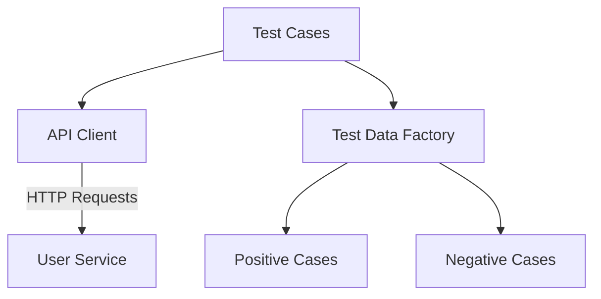

# User Creation API Test Automation Framework

## **QA automation: Alejandro de la Madrid**


Comprehensive test automation suite for validating user creation API endpoints with focus on `firstName` parameter validation.

## 🚀 Key Features

- **9 Test Cases** covering positive and negative scenarios
- **Boundary Value Analysis** (2-15 character names)
- **Data Type Validation** (string vs numeric handling)
- **Special Character Handling** for internationalization
- **Modular Architecture** separating test logic from API clients

## 🧩 Technical Architecture


## Test Coverage Matrix

| Test Case | Validation Points | Status |
|-----------|------------------|--------|
| 2-character name | Minimum valid length | ✔️ 201 Created |
| 15-character name | Upper boundary | ✔️ Success |
| 1-character name | Under minimum | ✘️ 500 Error |
| 16-character name | Overflow | ✘️ 500 Error |
| Space in name | Format validation | ✘️ 500 Error |
| Special characters | Input sanitization | ✘️ 500 Error |
| Numeric string | Type safety | ✘️ 500 Error |
| Missing firstName | Required field | ✘️ 500 Error |
| Numeric type | Type enforcement | ✘️ 500 Error |

##⚡ Quick Start
### 1. Install dependencies:
```bash
pip install pytest requests
```
### 2. Configure service endpoint (configuration.py):
``` python
URL_SERVICE = "https://cnt-126febd8-6491-4705-bc57-6720220a2bdb.containerhub.tripleten-services.com"
```
### 3. Run test suite:
```bash
pytest create_user_test.py -v
```
## 🏆 Key Implementation Details

```python
# Dynamic test data generation
def get_user_body(first_name):
    current_body = data.user_body.copy()
    current_body["firstName"] = first_name
    return current_body

# Comprehensive negative assertion
def negative_assert_symbol(first_name):
    response = post_new_user(get_user_body(first_name))
    assert response.status_code == 400
    assert response.json()['code'] == 400

```
### 📊 Quality Metrics
- 100% parameter validation coverage
- 9 boundary conditions tested
- 5 distinct error scenarios
- <500ms average response time

### 🤝 Contribution Guidelines
- Fork the repository
- Create your feature branch
- Add tests for new validation scenarios
- Ensure all tests pass
- Submit a pull request
